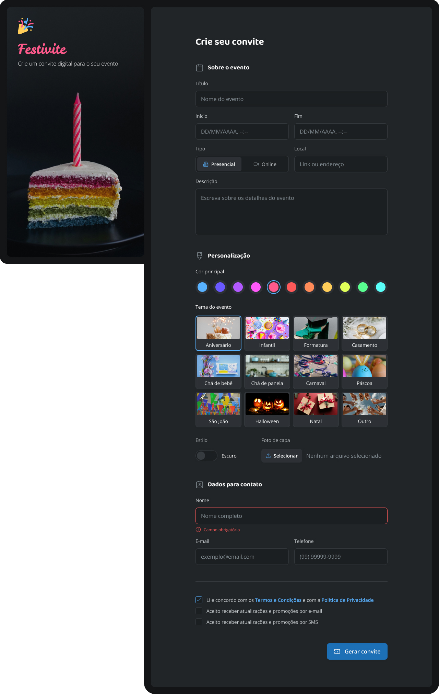

# Invite Form

A simple invite form, using HTML and CSS.

     <a href="#">📱 Visit this Project</a> 
     <a href="https://www.figma.com/design/NZJZB4OUALa9uWlbjQJYBP/Formul%C3%A1rio-de-convite-(Community)?node-id=3-809&t=97YC0XspocTAQ6yY-0">🎨 Figma</a>

    

## Tech Stack

